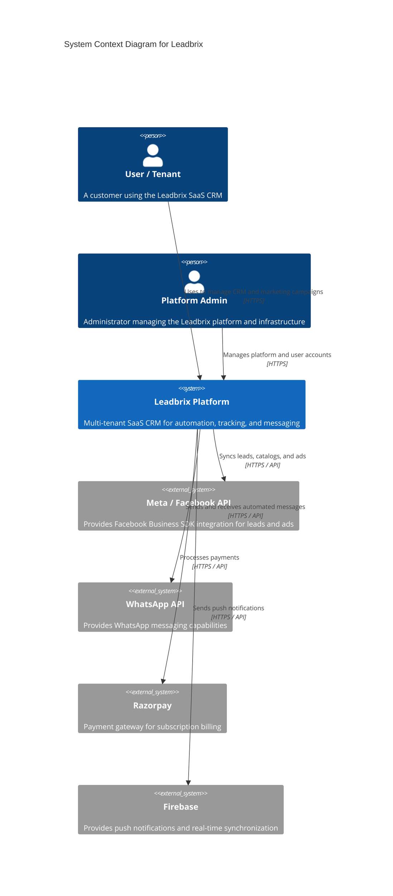
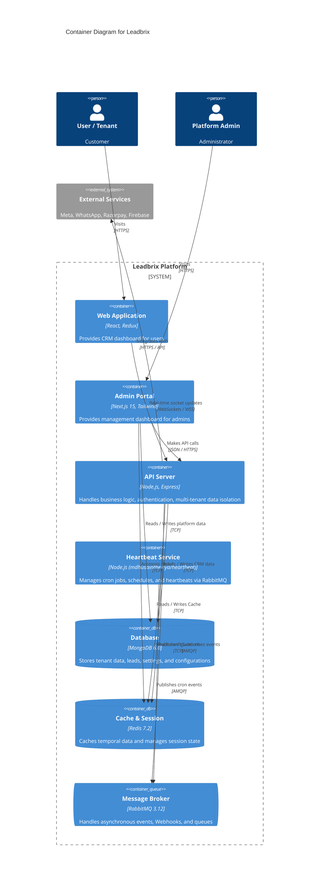
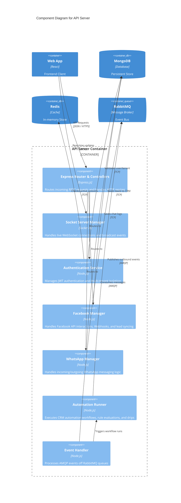

# Leadbrix Technical Documentation

## 1. Overview
Leadbrix is a multi-tenant SaaS CRM platform designed to connect backend systems with CRM functionalities. It integrates deeply with messaging and social media platforms (such as Meta and WhatsApp), providing tracking, automation, and real-time capabilities for seamless lead management and customer communication.

## 2. Technology Stack
- **Frontend (Web Application):** React 17, Redux, React Router, Bootstrap & Reactstrap, ApexCharts for data visualization, and Firebase for rich client-side features.
- **Admin Portal (leadbrix-admin):** Next.js 15, React 19, Tailwind CSS 4, and direct integration with MongoDB and Redis.
- **Backend (API Server):** Node.js 22+, Express.js, Socket.io for real-time web-sockets, and various SDKs including Facebook Node.js Business SDK, Firebase Admin, and Razorpay.
- **Message Brokers:** RabbitMQ (via `amqplib`) and Kafka (via `kafkajs`).
- **Databases & Cache:** MongoDB 6.0 and Redis 7.2.
- **Infrastructure & Deployment:** Docker, Docker Compose, Nginx.
- **Background Services:** A custom Heartbeat service (`mdhusainthekiya/heartbeat`) for robust Cron and RabbitMQ queue management.

## 3. C4 Architecture Diagrams

The architecture is described using the [C4 model](https://c4model.com/) to provide abstractions at various levels of detail.

### 3.1. System Context Diagram
This diagram shows the high-level system context, identifying the users of Leadbrix and the external systems it depends on.

### 3.2. Container Diagram
This diagram zooms into the system to show the high-level containers that make up Leadbrix.

### 3.3. Component Diagram (API Server)
This diagram zooms into the API Server container to show the structural components and application logic.

## 4. Key Application Logic
- **Automation Runner (`apiServer/applicationLogic/automationRunner.js`):** The core engine that processes marketing sequences, auto-replies, and drip campaigns for tenants.
- **Event Handler (`apiServer/applicationLogic/eventHandler.js`):** Coordinates asynchronous webhooks received from Facebook/WhatsApp and translates them into system actions.
- **Socket & Callback Managers:** Ensures robust bidirectional communication with the UI to provide a real-time experience (e.g., live chat interfaces and instant lead notifications).
